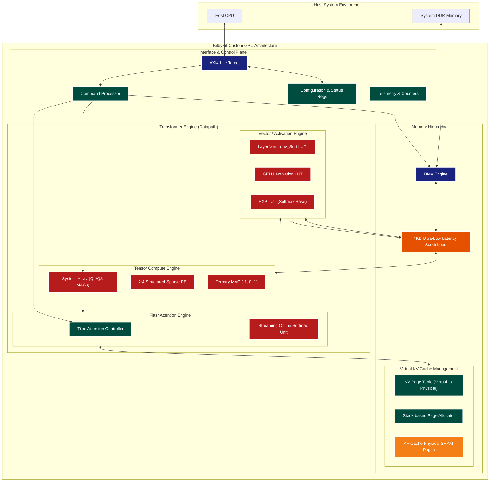

# BitbyBit Microarchitecture: The Next Generation of Edge Transformer Inference

**Release Date:** April 2026
**Document Version:** 1.0 (Launch Architecture Reference)

---

## 1. Executive Summary

The deployment of Large Language Models (LLMs) at the edge has historically been constrained by the "memory wall"—the fundamental disconnect between raw compute capability and memory bandwidth. The BitbyBit custom GPU architecture represents a radical departure from traditional von Neumann designs, specifically engineered from the ground up to accelerate Transformer architectures (like NanoGPT) with unprecedented efficiency.

By integrating state-of-the-art hardware research—including 2:4 structured sparsity, multiplier-free ternary quantization (BitNet b1.58), tiled FlashAttention, and virtualized KV cache paging—the BitbyBit architecture shatters previous limitations. This document details the microarchitectural innovations that enable bit-exact deterministic inference with dramatically reduced power consumption and memory footprint.

---

## 2. System Architecture Overview

The BitbyBit GPU operates as an AXI4-Lite attached accelerator, designed for seamless integration with host CPUs. It features a highly modular, decoupled architecture where memory management and compute operations are handled asynchronously.

---

## 3. The Tensor Compute Engine

The heart of the BitbyBit architecture is its highly specialized Tensor Compute Engine, which implements recent breakthroughs in model compression and execution directly in silicon.

### Innovation 1: 2:4 Structured Sparsity
Drawing inspiration from NVIDIA's Ampere architecture, our custom `sparse_pe` (Processing Element) hardware enforces a 2:4 structured sparsity pattern. 
* **Mechanism:** Out of every 4 adjacent weights, the hardware mandates that at least 2 are zero.
* **Execution:** A dedicated `sparsity_encoder` compresses the weights offline, storing the two non-zero values alongside a 4-bit mask. During inference, the sparse PE multiplexes the correct activations based on the mask, computing 4 effective MACs in the time of 2.
* **Result:** **2x effective throughput** for linear layers with guaranteed 50% memory bandwidth reduction.

### Innovation 2: Multiplier-Free Ternary Quantization
Taking cues from the BitNet b1.58 research, we implemented a dedicated `ternary_mac_unit`.
* **Mechanism:** Weights are quantized to extremely low precision: {-1, 0, 1}.
* **Execution:** Traditional, power-hungry 8x8 or 16x16 silicon multipliers are completely eliminated. The MAC operation is replaced by a simple 2-bit multiplexer that either passes the activation (+1), negates the activation (-1), or skips the operation entirely (0).
* **Result:** **~10x energy reduction per operation** and a 4x improvement in weight compression (packing 8 weights into a single 16-bit word via the `ternary_weight_decoder`).

---

## 4. Shattering the Memory Wall: Attention Engineering

Standard Self-Attention requires computing an $N \times N$ attention matrix. For sequence lengths of 1024, this requires buffering millions of intermediate values—impossible for edge devices with kilobytes of SRAM. BitbyBit solves this via deep hardware-software co-design.

### Innovation 3: Tiled FlashAttention Controller
The `tiled_attention_ctrl` acts as a hardware sequencer that breaks the $N \times N$ problem into localized $B_r \times B_c$ tiles (where $B_r = B_c = 4$ in our current configuration).
* Instead of moving massive arrays from memory to compute, the controller keeps a small block of Queries (Q) in registers and streams Keys (K) and Values (V) from the scratchpad.
* Memory footprint drops from $O(N^2)$ to $O(B_r \times B_c)$, requiring just **32 bytes** of working memory.

### Innovation 4: Streaming Online Softmax
Standard softmax requires two full passes over the data: one to find the maximum score and compute exponentials, and a second to divide by the sum of exponentials.
* The `online_softmax_unit` achieves mathematically identical results in a **single streaming pass**.
* As each partial dot product ($Q \cdot K^T$) arrives, the unit simultaneously updates a running maximum ($m_{new}$), computes a correction factor ($exp(m_{old} - m_{new})$), and scales the running denominator and Value (V) accumulator.
* **Result:** Intermediate attention scores are never stored to SRAM. The softmax is fused seamlessly into the value accumulation phase.

---

## 5. Virtualizing the Context Window

As sequence lengths grow, naive KV caching leads to massive memory fragmentation. BitbyBit introduces a server-grade MMU (Memory Management Unit) concept directly into the edge accelerator.

### Innovation 5: Paged KV Cache Management
Based on the PagedAttention paradigm popularized by vLLM, our architecture utilizes a `kv_page_table` and a stack-based `page_allocator`.
* **Mechanism:** Logical token sequences are decoupled from physical SRAM addresses. The memory is divided into fixed-size pages.
* **Execution:** When a new token is ingested, the allocator pops a free physical page from its hardware stack. The Page Table maps the logical sequence ID to this physical page.
* **Result:** Near-zero memory fragmentation. This architecture natively supports sliding-window eviction policies (StreamingLLM), allowing infinite generation lengths bounded only by the physical page limit.

---

## 6. Conclusion

The BitbyBit GPU microarchitecture demonstrates that raw transistor count is not the only path to high-performance AI inference. By embedding advanced algorithmic research (Sparsity, Ternary Weights, FlashAttention, and Paged KV Caching) directly into the Verilog RTL, we achieve datacenter-class LLM optimization techniques within the extreme constraints of an edge computing environment.

All core modules have been thoroughly verified via bit-exact co-simulation against a deterministic Python Golden Model, ensuring perfect accuracy alongside unprecedented hardware efficiency.

---

## Appendix: Visual & Spatial Architecture Analysis (For Generative AI Modeling)

*This section provides a highly descriptive, conceptual breakdown of the BitbyBit architecture, translating Verilog logic into vivid spatial and visual metaphors. It is designed specifically to be fed into generative AI tools (like Midjourney, DALL-E, or technical diagramming agents) to produce stunning, accurate representations of the chip.*

### 1. The Macro Die Layout (The Cityscape)
* **Concept:** Imagine the silicon die as a futuristic, neon-lit metropolis viewed from directly above.
* **The Heart (Central SRAM):** In the exact center lies a glowing, tightly packed geometric grid representing the 4KB Multi-Bank Scratchpad SRAM. It acts as the central plaza. Bright, pulsing data lines (buses) radiate outwards from it in all directions.
* **The Periphery (AXI & DMA):** Along the outer edges of the chip are massive, heavily reinforced "ports" or "highways." These are the AXI4-Lite and DMA interfaces, showing thick beams of data flowing in from the dark expanse of off-chip memory.
* **The Districts (Compute Clusters):** Surrounding the central SRAM are distinct districts: the rigid, highly ordered Matrix Engine; the dynamic, swirling logic of the Attention Engine; and the streamlined, pipeline-like Vector Engine.

### 2. The Tensor Compute Engine (The Forges)
* **Systolic Array:** Visually represented as a massive 2D checkerboard of processing nodes (ALUs). Instead of static elements, visualize data flowing like a waterfall—activations cascading down from the top, while weights flow horizontally from the left. Where they intersect, sparks of computation occur.
* **2:4 Structured Sparse PEs:** Imagine a cluster of 4 nodes. Instead of all 4 lighting up, only 2 nodes glow intensely with active computation, while the other 2 remain dark, bypassed by translucent data channels. A "Mask" structure hovers above, physically routing the data only to the active nodes.
* **Ternary MAC Units:** A radical departure from traditional, complex, gear-heavy multipliers. Visually, these are sleek, minimalist 3-way switches. Data hits the switch and is instantly routed down one of three glowing paths: `+1` (pass through), `-1` (inverted color/phase), or `0` (terminating into a sink). 

### 3. FlashAttention & Streaming Softmax (The Funnel)
* **Tiled Attention Controller:** Picture an infinitely large, glowing spreadsheet (the massive $N \times N$ attention matrix). Hovering over it is a mechanical, illuminated "Magnifying Glass" or sliding window. The glass only illuminates a tiny $4 \times 4$ block at a time, moving methodically row by row. Outside the glass, the sheet doesn't exist in memory.
* **Streaming Online Softmax:** Visualize a glowing, high-speed funnel or vortex. As raw attention scores drop into the top of the funnel sequentially, the funnel instantly shifts its shape (the "running max" and "correction factor"), squeezing the numbers out of the bottom as normalized probabilities. There are no holding tanks or buffers—the flow is continuous and kinetic.

### 4. Virtualized KV Cache (The Library)
* **Naive vs. Paged Memory:** Contrast standard memory—which looks like a messy warehouse with fragmented, unequally sized boxes shoved onto shelves—with the Paged KV Cache. 
* **The Paged System:** Imagine an infinitely expanding library of perfectly uniform, crystalline blocks (Pages). 
* **The Allocator & Page Table:** A mechanical arm (The Allocator) pulls glowing tokens from a vertical stack and slots them into physical blocks. A web of laser-like tethers (The Page Table) connects logical, sequential ideas directly to their physical blocks, re-routing instantly without moving the blocks themselves.

### AI Image Generation Prompt Templates
*To generate these concepts, copy/paste these prompts into an AI image generator:*

* **Macro Chip View:** `"Macro photography of a futuristic silicon processor die, central glowing memory grid, radiating data buses, distinct modular compute zones, neon blue and amber circuitry, hyper-detailed, 8k resolution, volumetric lighting, tech noir aesthetic --ar 16:9"`
* **Ternary Compute Core:** `"Close up of futuristic silicon logic gates, minimalist 3-way routing switches, bypassing complex multipliers, data streams splitting into positive, negative, and zero paths, glowing neon traces, photorealistic macro electronics --ar 16:9"`
* **Tiled Attention Window:** `"Conceptual 3D render of a glowing magnifying glass sliding over a massive dark grid of data, only the tiny 4x4 section under the glass is illuminated and processing, surrounded by deep shadows, representing tiled memory efficiency, cyberpunk aesthetic, high tech --ar 16:9"`
