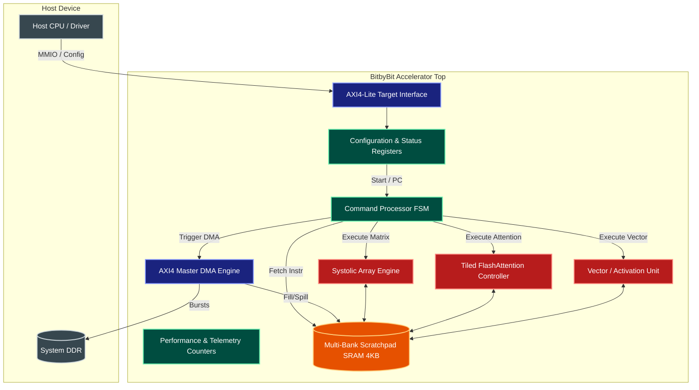
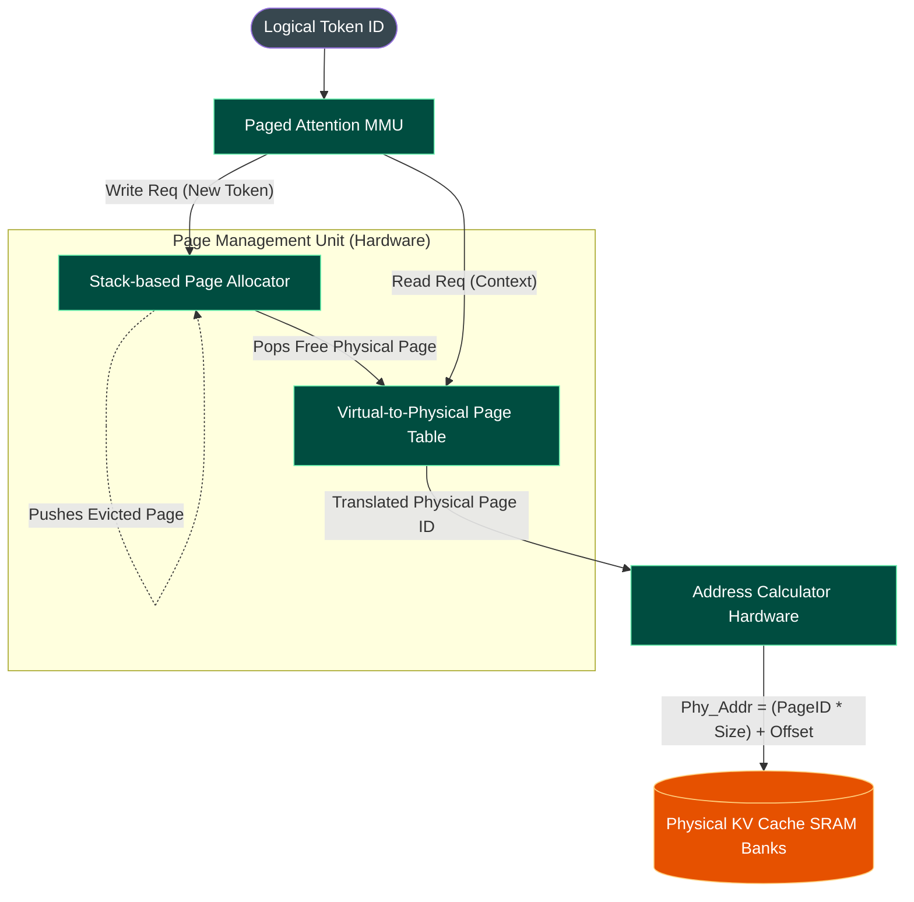
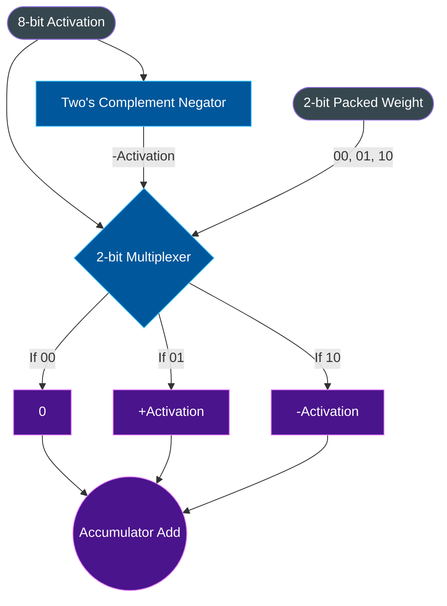
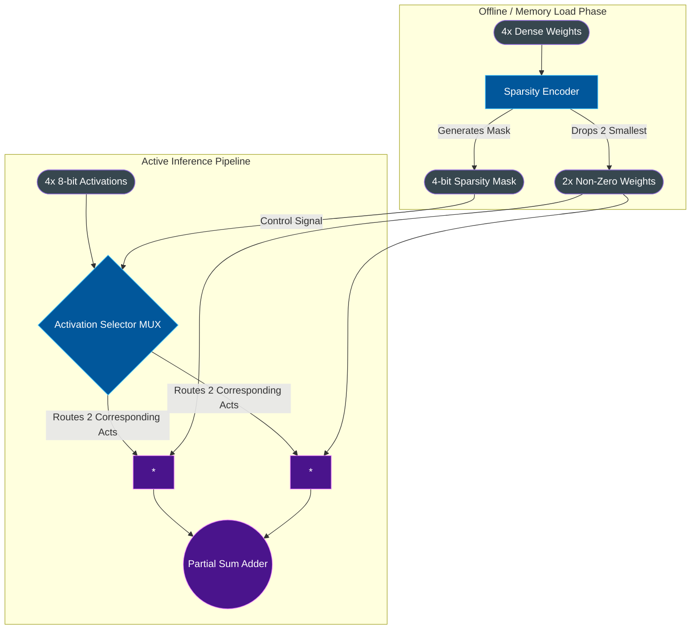

# BitbyBit Detailed Architecture Diagrams

This document contains detailed, component-level architectural diagrams for the BitbyBit custom Transformer GPU. These diagrams are intended for RTL engineers, compiler writers, and architects needing to understand the exact datapath, memory flow, and hardware accelerator interactions.

---

## 1. Top-Level System-on-Chip (SoC) Topology

This diagram shows the complete integration of the BitbyBit accelerator within the host environment, highlighting the command interface, DMA memory pathways, and multi-banked SRAM structure.

---

## 2. Transformer NanoGPT Datapath Pipeline

This diagram traces the exact, cycle-accurate flow of a token passing through a single Transformer block in the BitbyBit engine. It highlights where specific hardware accelerators (like the Online Softmax and LUTs) sit within the pipeline.

```mermaid
flowchart LR
    classDef data fill:#424242,stroke:#fff,color:#fff;
    classDef compute fill:#B71C1C,stroke:#FF8A80,color:#fff;
    classDef memory fill:#E65100,stroke:#FFD180,color:#fff;
    classDef math fill:#4A148C,stroke:#EA80FC,color:#fff;

    TokenIn([Token & Pos ID]):::data --> EmbLookup[Embedding Lookup]:::memory
    EmbLookup --> ResAdd1((+)):::math
    EmbLookup --> LN1[LayerNorm 1]:::compute
    
    subgraph AttentionBlock ["Hardware Accelerated Attention"]
        direction TB
        LN1 --> QKV[Q, K, V Linear Projections]:::compute
        QKV --> TiledCtrl[Tiled FlashAttention Controller]:::compute
        
        TiledCtrl -- "O(Tile) K/V Reads" --> KVCache[(Paged KV Cache)]:::memory
        
        TiledCtrl --> |"Q_tile, K_tile, V_tile"| OSM[Streaming Online Softmax]:::compute
        
        subgraph SoftmaxInner ["Online Softmax Fused Core"]
            direction LR
            Max[Running Max]:::math --> ExpCorr[EXP LUT: Correction]:::math
            Score[Current Score] --> ExpNew[EXP LUT: New Term]:::math
            ExpCorr & ExpNew --> VAcc[V Vector Accumulator]:::math
        end
        OSM -.-> SoftmaxInner
        
        OSM --> |"Fused Attn_Out"| WO[Output Projection Wo]:::compute
    end
    
    WO --> ResAdd1
    
    ResAdd1 --> LN2[LayerNorm 2]:::compute
    
    subgraph FFNBlock ["Feed Forward Network"]
        direction TB
        LN2 --> W1[Linear W1]:::compute
        W1 --> GELU[GELU Activation LUT]:::math
        GELU --> W2[Linear W2]:::compute
    end
    
    W2 --> ResAdd2((+)):::math
    ResAdd1 --> ResAdd2
    
    ResAdd2 --> FinalLN[Final LayerNorm]:::compute
    FinalLN --> Logits([Logits Projection & Argmax]):::data
```

---

## 3. Paged KV Cache Memory Subsystem

To break the memory wall, BitbyBit treats the KV Cache like a virtual memory system. This diagram details the MMU-like translation process that allows zero-fragmentation sliding-window attention.

---

## 4. Compute Microarchitecture Accelerators

A deep dive into the two major hardware innovations that drastically reduce multiplier logic area and power consumption.

### 4A. Multiplier-Free Ternary MAC (BitNet b1.58)
Replaces power-hungry 8x8 or 16x16 silicon multipliers with a simple multiplexer, shifting the paradigm from multiplication to conditional addition.

### 4B. 2:4 Structured Sparsity PE
Enforces a 50% sparsity pattern, doubling the effective throughput of the matrix math engine by skipping predetermined zero-weights.

