# Custom GPU Architecture for GPT-2 Inference

## Overview

A fully custom GPU architecture designed from scratch in Verilog, capable of running GPT-2 transformer inference. The design implements all core operations needed by a large language model — from basic zero-skip multiplication up to full multi-head attention — entirely in hardware.

**Key Specs:**
- **16 Verilog modules** across 4 design layers
- **Q8.8 fixed-point** arithmetic throughout (no floating point)
- **Zero-skip optimization** — skips 90% of multiplications in sparse models
- **Variable-precision ALU** — processes 4-bit, 8-bit, or 16-bit data
- **Pipelined transformer blocks** — LayerNorm → Attention → FFN with residual connections
- **Simulated with Icarus Verilog**, waveform output via GTKWave

---

## Architecture Diagram

```mermaid
graph TB
    subgraph "GPT-2 Inference Engine"
        direction TB
        TOKEN["Token Input"] --> EMB["Embedding Lookup<br/>(Token + Position)"]
        EMB --> TB1["Transformer Block 1"]
        TB1 --> TB2["Transformer Block 2"]
        TB2 --> TBN["... × N Layers"]
        TBN --> LNF["Final LayerNorm"]
        LNF --> ARGMAX["Argmax → Token Output"]
    end

    subgraph "Each Transformer Block"
        direction TB
        XIN["Input x"] --> LN1["Layer Norm 1"]
        LN1 --> ATTN["Multi-Head<br/>Self-Attention"]
        ATTN --> ADD1["+ Residual"]
        XIN --> ADD1
        ADD1 --> LN2["Layer Norm 2"]
        LN2 --> FFN["Feed-Forward<br/>Network"]
        FFN --> ADD2["+ Residual"]
        ADD1 --> ADD2
        ADD2 --> XOUT["Output"]
    end

    subgraph "Attention Unit"
        direction LR
        QP["Q = x·Wq"] --> SCORE["Q·K^T"]
        KP["K = x·Wk"] --> SCORE
        VP["V = x·Wv"] --> SCALED["÷ √d_k"]
        SCORE --> SCALED
        SCALED --> SM["Softmax"]
        SM --> AV["Score·V"]
        AV --> OP["× Wo"]
    end

    subgraph "Feed-Forward Network"
        direction LR
        L1["Linear 1<br/>(expand 4×)"] --> GELU["GELU<br/>Activation"]
        GELU --> L2["Linear 2<br/>(project back)"]
    end

    style TOKEN fill:#ff6b6b,color:#fff
    style ARGMAX fill:#51cf66,color:#fff
    style EMB fill:#339af0,color:#fff
    style TB1 fill:#845ef7,color:#fff
    style TB2 fill:#845ef7,color:#fff
    style TBN fill:#845ef7,color:#fff
    style LNF fill:#339af0,color:#fff
```



---

## Module Hierarchy

```mermaid
graph TD
    GPU["gpt2_engine.v<br/>🧠 Full Inference Engine"] --> EMB2["embedding_lookup.v<br/>📖 Token + Position Embedding"]
    GPU --> TFB["transformer_block.v<br/>🔄 Decoder Block (×N)"]
    GPU --> LNF2["layer_norm.v<br/>📏 Final Normalization"]

    TFB --> LN1B["layer_norm.v<br/>📏 Pre-Attention Norm"]
    TFB --> ATT["attention_unit.v<br/>👁️ Multi-Head Attention"]
    TFB --> LN2B["layer_norm.v<br/>📏 Pre-FFN Norm"]
    TFB --> FFNB["ffn_block.v<br/>⚡ Feed-Forward Network"]

    ATT --> LL1["linear_layer.v<br/>📐 Q/K/V/O Projections"]
    ATT --> SM2["softmax_unit.v<br/>📊 Attention Scores"]
    ATT --> SA2["systolic_array.v<br/>🔢 Matrix Multiply"]

    FFNB --> LL2["linear_layer.v<br/>📐 Up/Down Projection"]
    FFNB --> GELU2["gelu_activation.v<br/>⚡ GELU Activation"]

    LL1 --> MAC2["mac_unit.v<br/>✖️ Multiply-Accumulate"]
    SA2 --> ZDM["zero_detect_mult.v<br/>🎯 Zero-Skip Multiply"]
    SA2 --> VPA["variable_precision_alu.v<br/>🔧 4/8/16-bit ALU"]

    subgraph "Memory Subsystem"
        SMC["sparse_memory_ctrl.v<br/>💾 CSR Sparse Storage"]
        FDQ["fused_dequantizer.v<br/>🔄 INT4→INT8 On-Fly"]
    end

    style GPU fill:#ff6b6b,color:#fff,stroke-width:3px
    style TFB fill:#845ef7,color:#fff
    style ATT fill:#339af0,color:#fff
    style FFNB fill:#339af0,color:#fff
    style EMB2 fill:#20c997,color:#fff
    style SMC fill:#fab005,color:#000
    style FDQ fill:#fab005,color:#000
```



---

## Design Layers

### Layer 1 — Core Compute Primitives
The fundamental building blocks — every computation in the GPU flows through these.

| Module | Purpose | Key Feature |
|--------|---------|-------------|
| `zero_detect_mult` | Multiply with zero bypass | Skips 90% ops in sparse models |
| `variable_precision_alu` | Multi-precision ALU | 4×4-bit, 2×8-bit, or 1×16-bit parallel |
| `sparse_memory_ctrl` | CSR sparse storage | Only stores/fetches non-zero weights |
| `fused_dequantizer` | INT4→INT8 converter | Zero-latency in-pipeline dequantization |
| `gpu_top` | Pipeline controller | Coordinates all 4 primitives |

### Layer 2 — Compute Modules
Neural-network–specific compute units built from Layer 1 primitives.

| Module | Purpose | Key Feature |
|--------|---------|-------------|
| `mac_unit` | Multiply-Accumulate | Dot product building block with zero-skip |
| `systolic_array` | NxN matrix multiply | Weight-stationary dataflow, zero-skip |
| `gelu_activation` | GELU activation | Piecewise-linear Q8.8 approximation |
| `softmax_unit` | Softmax normalization | LUT-based exp with max-subtract stability |

### Layer 3 — Transformer Blocks
Complete transformer layer components.

| Module | Purpose | Key Feature |
|--------|---------|-------------|
| `layer_norm` | Layer normalization | Mean/variance/normalize with γ/β |
| `linear_layer` | Dense matrix-vector | y = Wx + b with weight loading |
| `attention_unit` | Multi-head attention | Q/K/V projections + output projection |
| `ffn_block` | Feed-forward network | Linear→GELU→Linear pipeline |

### Layer 4 — GPT-2 Integration
The complete inference engine.

| Module | Purpose | Key Feature |
|--------|---------|-------------|
| `embedding_lookup` | Token + position embedding | Table lookup with addition |
| `transformer_block` | Full decoder block | LN→Attn→Residual→LN→FFN→Residual |
| `gpt2_engine` | GPT-2 inference engine | N-layer pipeline with argmax output |

---

## Fixed-Point Arithmetic: Q8.8

All computations use **Q8.8 signed fixed-point** — 8 integer bits, 8 fractional bits in a 16-bit word.

```
Bit layout:  [S IIIIIII . FFFFFFFF]
              │  7 bits    8 bits
              └─ sign bit

Range:  -128.0 to +127.996
Precision: 1/256 ≈ 0.0039

Example: 3.5 in Q8.8 = 3.5 × 256 = 896 = 0x0380
         -1.0 in Q8.8 = -1.0 × 256 = -256 = 0xFF00
```

**Why Q8.8?** Floating point requires enormous hardware (thousands of gates per multiply). Fixed-point gives us hardware-efficient arithmetic with sufficient precision for transformer inference.

---

## Data Flow Through the GPU


---

## Performance Characteristics

| Metric | Value |
|--------|-------|
| Pipeline latency (2-layer config) | ~130 clock cycles per token |
| Zero-skip savings | Up to 90% multiply operations skipped |
| Precision modes | 4-bit, 8-bit, 16-bit (runtime switchable) |
| Memory format | Compressed Sparse Row (CSR) |
| Weight quantization | INT4 with on-chip dequantization |
| Arithmetic format | Q8.8 signed fixed-point (16-bit) |

---

## File Structure

```
custom_gpu_project/
├── rtl/
│   ├── primitives/          # Layer 1: Core compute
│   │   ├── zero_detect_mult.v
│   │   ├── variable_precision_alu.v
│   │   ├── sparse_memory_ctrl.v
│   │   ├── fused_dequantizer.v
│   │   └── gpu_top.v
│   ├── compute/             # Layer 2: Neural net compute
│   │   ├── mac_unit.v
│   │   ├── systolic_array.v
│   │   ├── gelu_activation.v
│   │   └── softmax_unit.v
│   ├── transformer/         # Layer 3: Transformer blocks
│   │   ├── layer_norm.v
│   │   ├── linear_layer.v
│   │   ├── attention_unit.v
│   │   └── ffn_block.v
│   └── gpt2/               # Layer 4: Full inference
│       ├── embedding_lookup.v
│       ├── transformer_block.v
│       └── gpt2_engine.v
├── tb/                      # Mirror structure for testbenches
├── sim/waveforms/           # VCD waveform output
├── scripts/
│   ├── run_all_tests.ps1    # Run full test suite
│   └── generate_weights.py  # Weight file generator
└── docs/
    └── architecture.md      # This file
```

---

## Tools

| Tool | Purpose |
|------|---------|
| **Icarus Verilog** | RTL simulation and compile |
| **GTKWave** | Waveform visualization |
| **Python + NumPy** | Weight generation, reference models |

---

## How to Run

```powershell
# Run all tests (from project root)
.\scripts\run_all_tests.ps1

# Run a single module test
D:\Tools\iverilog\bin\iverilog.exe -o sim/test rtl/primitives/zero_detect_mult.v tb/primitives/zero_detect_mult_tb.v
D:\Tools\iverilog\bin\vvp.exe sim/test

# View waveforms
D:\Tools\iverilog\bin\gtkwave.exe sim/waveforms/zero_detect_mult.vcd

# Generate weights
python scripts\generate_weights.py --mode identity --embed-dim 4 --num-layers 2
```
