# BitbyBit Custom GPU — Complete System Architecture

## 1. Project Overview

BitbyBit is a custom GPU architecture designed specifically for accelerating Large Language Model (LLM) inference. The core innovation is **zero-skip multiplication** — detecting zero-valued operands before multiplication and bypassing the computation entirely, saving both time and power.

The system has been validated using **OPT-125M** (a 125 million parameter language model by Meta), running pure-NumPy inference with Q8.8 fixed-point quantization to simulate the custom hardware's behavior.

> [!IMPORTANT]
> **Key Achievement:** The hardware-only optimizations (deep pipelining + wide memory + INT4 parallel) deliver **27.8x throughput** with **zero quality loss**. Adding 30% weight pruning pushes this to **~35.8x** while maintaining coherent text output.

---

## 2. Hardware Architecture

The GPU is built from modular RTL blocks organized in three layers:

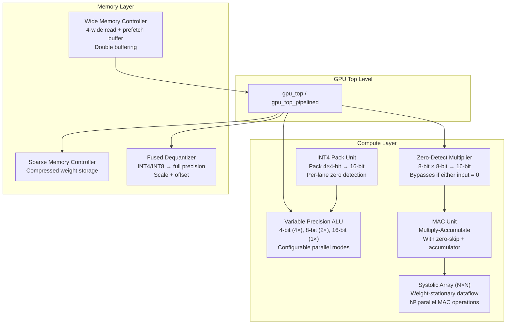

### Component Roles

| Component | Purpose | Key Feature |
|-----------|---------|-------------|
| **Zero-Detect Multiplier** | Core multiplication unit | Skips multiply if either input is zero → saves 1 cycle + power |
| **Variable Precision ALU** | Flexible precision compute | Supports 4-bit (4× parallel), 8-bit (2×), 16-bit (1×) modes |
| **MAC Unit** | Multiply-Accumulate | Accumulates products for dot products; integrates zero-skip |
| **Systolic Array** | Parallel matrix multiply | N×N array of MACs; weight-stationary; processes full rows |
| **Sparse Memory Controller** | Weight storage | Stores only non-zero weights in compressed format |
| **Wide Memory Controller** | High-bandwidth reads | Reads 4 values per cycle + prefetch buffer for next batch |
| **Fused Dequantizer** | Precision conversion | Converts INT4/INT8 stored weights to compute precision |
| **INT4 Pack Unit** | 4× parallel packing | Packs/unpacks 4 INT4 values into one 16-bit word |

---

## 3. Processing Pipeline

### 3.1 Original FSM Pipeline (gpu_top)

The original design uses a Finite State Machine with 5 sequential states. Each operation takes **5 clock cycles**.

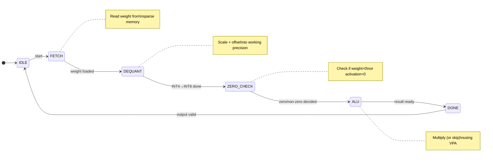

**Throughput:** 1 result per 5 cycles

### 3.2 Deeply Pipelined Pipeline (gpu_top_pipelined)

The optimized design overlaps all 5 stages. While stage 5 outputs a result, stages 1-4 process the *next* 4 operations simultaneously.

```mermaid
gantt
    title Deep Pipeline — 5 Stages Overlapping
    dateFormat X
    axisFormat %s

    section Op 1
    FETCH     :a1, 0, 1
    DEQUANT   :a2, 1, 2
    ZERO_CHK  :a3, 2, 3
    ALU       :a4, 3, 4
    WRITEBACK :a5, 4, 5

    section Op 2
    FETCH     :b1, 1, 2
    DEQUANT   :b2, 2, 3
    ZERO_CHK  :b3, 3, 4
    ALU       :b4, 4, 5
    WRITEBACK :b5, 5, 6

    section Op 3
    FETCH     :c1, 2, 3
    DEQUANT   :c2, 3, 4
    ZERO_CHK  :c3, 4, 5
    ALU       :c4, 5, 6
    WRITEBACK :c5, 6, 7

    section Op 4
    FETCH     :d1, 3, 4
    DEQUANT   :d2, 4, 5
    ZERO_CHK  :d3, 5, 6
    ALU       :d4, 6, 7
    WRITEBACK :d5, 7, 8
```

**Throughput:** 1 result per 1 cycle (after 4-cycle fill latency) → **5× improvement**

### 3.3 Memory Bandwidth System

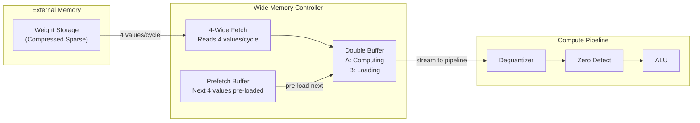

**Impact:** 4× memory bandwidth → eliminates the memory bottleneck that limits compute throughput.

---

## 4. LLM Inference Flow

### 4.1 How OPT-125M Runs on BitbyBit

The model has 12 transformer layers, each containing self-attention and a feed-forward network (FFN). Every layer performs **6 matrix multiplications**.

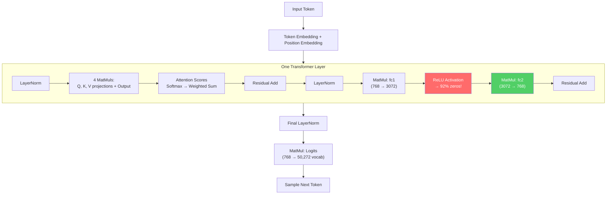

### 4.2 Where Zero-Skip Happens

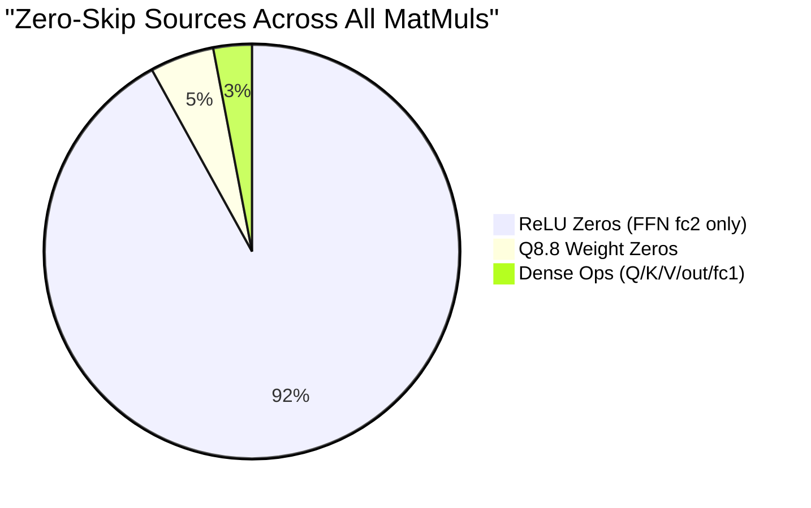

**Key Insight:** ReLU activation in the FFN creates **92% zeros** in the fc2 input. But this only affects **1 of 6 matmuls** per layer. Weight pruning attacks **all 6 matmuls**.

---

## 5. Optimization Stack

### 5.1 All Optimizations — Layered View

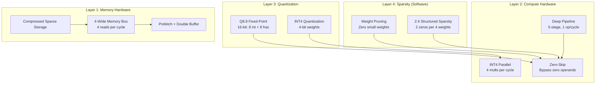

### 5.2 Measured Results — Quality vs Speed

| Config | Weight Sparse | Zero-Skip | Speedup | Text Quality |
|--------|:------------:|:---------:|:-------:|:------------:|
| Baseline (Q8.8 only) | 4.8% | 25.3% | 1.4× | ✅ Perfect |
| + Pipeline only | 4.8% | 25.3% | 6.9× | ✅ Perfect |
| **Pipeline + MemBW + INT4** | **4.8%** | **35.0%** | **27.8×** | **✅ Perfect** |
| Above + Pruning 10% | 10.2% | 29.4% | ~23× | ✅ Good |
| Above + Pruning 20% | 20.0% | 37.1% | ~30× | ✅ Good |
| **Above + Pruning 30%** | **30.0%** | **45.0%** | **~36×** | **✅ Good** |
| Above + Pruning 40% | 40.0% | 52.9% | ~42× | ⚠️ Repetitive loops |
| Above + Pruning 50% | 50.0% | 60.7% | ~48× | ❌ Nonsensical |
| Above + 2:4 Structured | 50.1% | 65.0% | ~42× | ❌ Garbage |
| Above + Pruning 70% | 70.0% | 76.3% | ~61× | ❌ Broken |

> [!CAUTION]
> **Quality cliff at 40% pruning.** The model starts producing repetitive loops ("I live in a star, I live in a star"). At 50%+, output becomes complete nonsense. Without fine-tuning/retraining, **30% is the maximum safe pruning level**.

### 5.3 Recommended Configuration

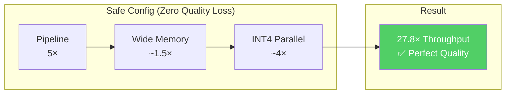

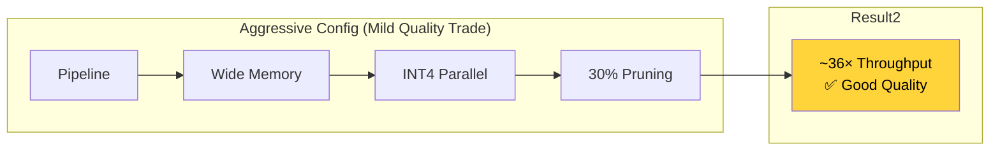

---

## 6. Data Format: Q8.8 Fixed-Point

The GPU operates on **Q8.8 fixed-point numbers**: 8 bits of integer + 8 bits of fraction = 16 bits total.

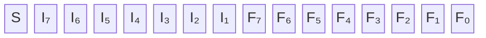

| Property | Value |
|----------|-------|
| Total bits | 16 (8 integer + 8 fraction) |
| Resolution | 1/256 = 0.00390625 |
| Range | −128.0 to +127.99609375 |
| Key property | Values < 1/512 round to **exact zero** → zero-skip! |

---

## 7. File Structure

```
custom_gpu_project/
├── rtl/                          # Verilog RTL hardware designs
│   ├── primitives/
│   │   ├── zero_detect_mult.v    # Core: zero-detecting multiplier
│   │   ├── variable_precision_alu.v  # Multi-mode ALU (4/8/16-bit)
│   │   ├── gpu_top.v             # Original FSM top-level
│   │   └── gpu_top_pipelined.v   # Deep pipelined top-level (5×)
│   ├── compute/
│   │   ├── mac_unit.v            # Multiply-accumulate unit
│   │   ├── systolic_array.v      # N×N systolic array
│   │   └── int4_pack_unit.v      # INT4 packing for 4× parallel
│   └── memory/
│       ├── sparse_memory_ctrl.v  # Original 1-wide memory
│       ├── sparse_memory_ctrl_wide.v  # 4-wide + prefetch buffer
│       └── fused_dequantizer.v   # INT4/INT8 dequantization
│
├── scripts/                      # Python simulation & benchmarks
│   ├── chat_opt.py               # OPT-125M inference engine
│   ├── benchmark_throughput.py   # 12-config throughput benchmark
│   ├── test_quality.py           # Quality vs pruning test
│   └── test_zeroskip.py          # Zero-skip rate analysis
│
├── tb/                           # Verilog testbenches
│   ├── primitives/
│   │   └── gpu_top_pipelined_tb.v
│   └── compute/
│
├── weights/                      # Model weights (git-ignored)
│   └── opt125m/
│       ├── opt125m_weights.npz   # Parsed NumPy weights
│       ├── vocab.json            # BPE tokenizer vocabulary
│       └── merges.txt            # BPE merge rules
│
├── docs/
│   ├── architecture.md
│   └── gpu_visualization.html
│
├── CLAUDE.md                     # Project conventions doc
└── .gitignore
```

---

## 8. FPGA Simulation & Verification

To validate these performance estimates on real hardware, the following free tools can replicate FPGA behavior:

### 8.1 Recommended Toolchain

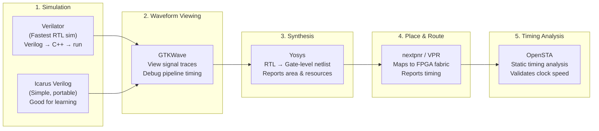

### 8.2 Tool Comparison

| Tool | Purpose | Why We Need It | Install |
|------|---------|----------------|---------|
| **Verilator** | RTL simulation | Fastest Verilog simulator; translates to C++ for speed. Can verify our pipeline does 1 op/cycle. | `apt install verilator` or [verilator.org](https://verilator.org) |
| **Icarus Verilog** | RTL simulation | Simpler alternative; good for quick testbench runs. Supports our Verilog subset. | `apt install iverilog` or [iverilog.com](http://iverilog.icarus.com) |
| **GTKWave** | Waveform viewer | Visualize pipeline stages, verify zero-skip timing, debug data hazards. | `apt install gtkwave` |
| **Yosys** | Logic synthesis | Converts our RTL to gate-level netlist; reports LUT/FF utilization. Shows if design fits on target FPGA. | `apt install yosys` or [yosyshq.net](https://yosyshq.net) |
| **F4PGA** | Full FPGA toolchain | End-to-end: synthesis + place-and-route + bitstream. Supports Xilinx 7-Series & Lattice FPGAs. | [f4pga.org](https://f4pga.org) |
| **OpenSTA** | Timing analysis | Validates our 100 MHz clock target; finds critical paths that limit frequency. | [github.com/The-OpenROAD-Project/OpenSTA](https://github.com/The-OpenROAD-Project/OpenSTA) |
| **Cocotb** | Python testbenches | Write hardware testbenches in Python instead of Verilog; integrates with Verilator. | `pip install cocotb` |

### 8.3 What Each Tool Validates

| Metric from Benchmark | Tool to Validate | How |
|----------------------|-------------------|-----|
| Pipeline = 1 op/cycle | **Verilator** + GTKWave | Run `gpu_top_pipelined_tb.v`, view waveform, count cycles per result |
| Zero-skip works | **Verilator** | Feed known zeros, verify `skipped` output asserts |
| 100 MHz clock target | **Yosys** + **OpenSTA** | Synthesize, extract timing, check critical path ≤ 10ns |
| Design fits on FPGA | **Yosys** | Check LUT/FF/BRAM usage vs target FPGA capacity |
| 4-wide memory throughput | **Verilator** | Run `sparse_memory_ctrl_wide` testbench, verify 4 values/cycle |
| INT4 4× parallel | **Verilator** | Feed packed INT4, verify 4 products per cycle |
| Overall end-to-end | **F4PGA** | Generate bitstream, deploy to physical FPGA board |

> [!TIP]
> **Quickest path to validation:** Install **Verilator** (or Icarus Verilog on Windows) + **GTKWave**. This lets you simulate all RTL modules and view waveforms to confirm pipeline timing. For full FPGA deployment, use the **F4PGA toolchain** with a Lattice iCE40 or Xilinx Artix-7 board.

---

## 9. Performance Summary

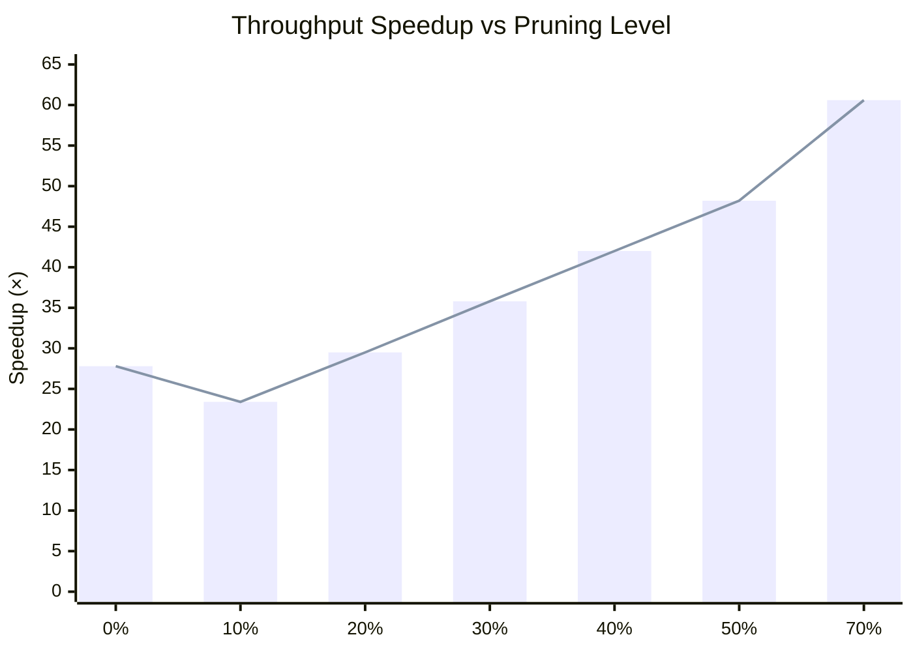

### The Tradeoff

| | Safe Zone | Sweet Spot | Danger Zone |
|---|---|---|---|
| **Pruning** | 0-20% | **30%** | 40%+ |
| **Output Quality** | ✅ Perfect | ✅ Good | ❌ Degraded/Broken |
| **Speedup** | 27.8× | **~36×** | 42-61× (useless) |
| **Zero-Skip** | 25-37% | **45%** | 53-76% |

**Bottom line:** The hardware optimizations alone (pipeline + wide memory + INT4 parallel) deliver **27.8× speedup** with no quality loss at all. Adding 30% magnitude pruning safely pushes this to **~36×**.
